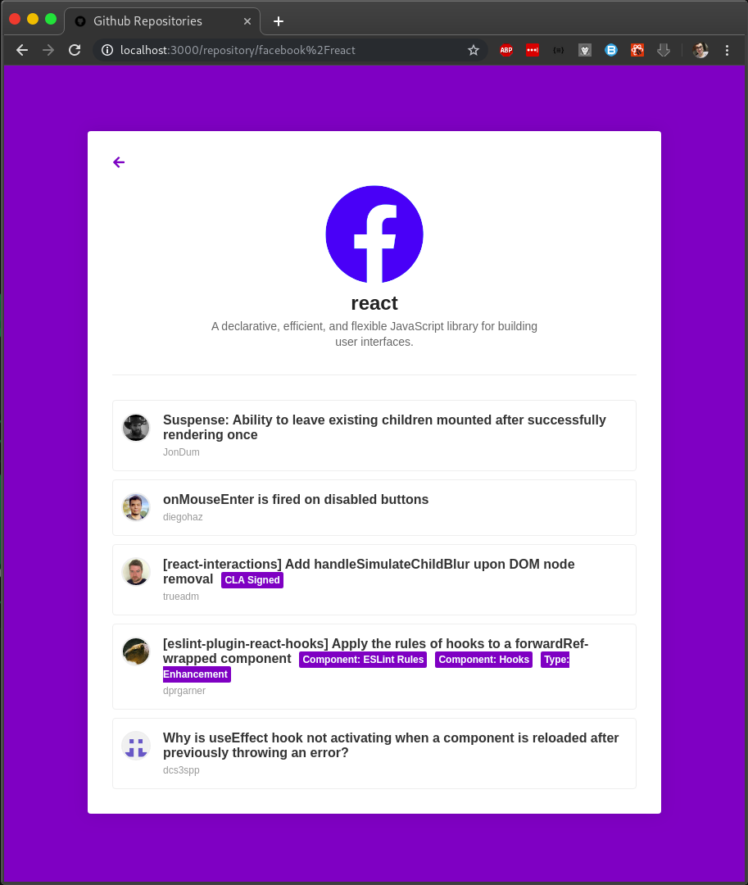

# Github Repositories

Application create to add the desired repositories and see some details about them, as well their issues in the details tab.

------------------------------------------------------------

Aplicação criada para adicionar os repositórios desejados e ver alguns detalhes sobre eles, juntamente com suas issues na aba de detalhes.

